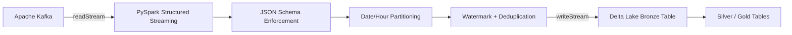
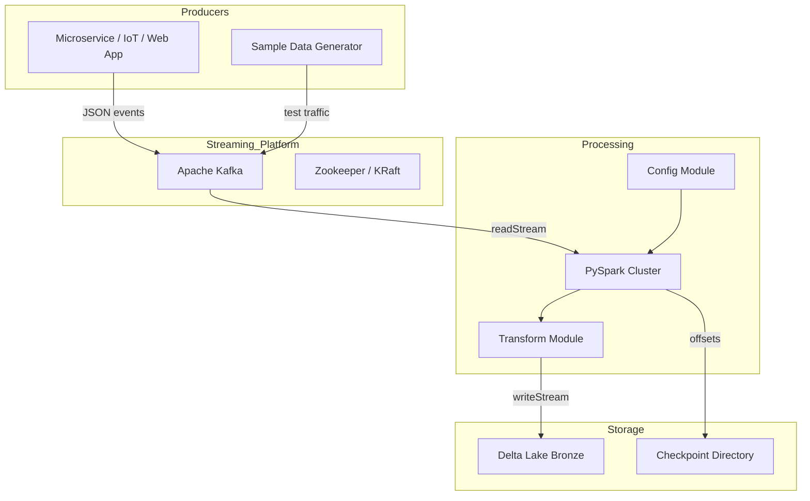

# Kafka → PySpark → Delta Lake — Architecture

## 1. High-Level Design

This is a production-style, near real-time event ingestion pipeline. It consumes JSON events from **Apache Kafka**, validates and enriches them with **PySpark Structured Streaming**, and writes the cleansed stream to a **Delta Lake** bronze table with exactly-once semantics.

---

## 2. Component Diagram

---

## 3. Data Flow

1. **Event Production** — JSON events land on a Kafka topic (`events` by default) with an `event_id`, `event_timestamp`, and payload.
2. **Ingestion** — `spark.readStream` consumes micro-batches from Kafka using the `kafka` source.
3. **Parsing** — Kafka `value` is cast to string, parsed with `from_json`, and validated against a schema defined in `src/pipeline/config.py`.
4. **Enrichment** — `ingested_at`, `event_date`, and `event_hour` columns are added to support partition pruning.
5. **Deduplication** — A `watermark` on `event_timestamp` bounds state; `dropDuplicates("event_id")` removes replays.
6. **Sink** — `writeStream` writes to Delta Lake using `foreachBatch` or `trigger(once)` and persists Kafka offsets in a `checkpoint` directory.

---

## 4. Scalability Strategy

- **Kafka:** Add partitions to increase throughput; consumers scale by partition assignment.
- **Spark:** Increase executor count and cores for higher parallelism on `readStream`.
- **Delta Lake:** Partition by `event_date` / `event_hour` to reduce scan scope for downstream queries.
- **Compaction:** Periodically run `OPTIMIZE` and `VACUUM` on Delta tables to control file count.

---

## 5. Fault Tolerance

- **Checkpointing:** Spark Structured Streaming stores offsets and state in the configured `CHECKPOINT_PATH`.
- **Exactly-Once Delivery:** Kafka offset tracking + Delta Lake idempotent `merge` writes guarantee no duplicates or lost events.
- **Watermarking:** Late-arriving data beyond the watermark threshold is dropped to cap unbounded state growth.
- **Idempotent Sinks:** Writes are partition-safe and overwrite-aware, enabling safe restart without reprocessing.

---

## 6. Failure Recovery

| Failure | Recovery Mechanism |
|---|---|
| Spark driver crash | Restart the streaming query; it resumes from the last checkpoint. |
| Kafka broker outage | Query pauses until the broker is available; no data loss if retention is sufficient. |
| Bad/invalid event | Schema enforcement rejects corrupt events; a future dead-letter queue can capture them. |
| Delta path corruption | Re-create the path from raw Kafka replay if retention allows, or use Delta time-travel. |

---

## 7. Security Considerations

- Kafka broker credentials are externalized via environment variables (see `.env.example`).
- No credentials are committed to source control.
- TLS can be enabled for Kafka by setting `security.protocol` in the Kafka reader options.
- PII/PHI should be tokenized before ingestion or handled via column-level masking in the silver/gold layers.
- Checkpoints and Delta paths use least-privilege storage permissions.

---

## 8. Deployment Model

| Target | How |
|---|---|
| **Local / Dev** | `docker-compose up -d` spins up Kafka + Zookeeper. Run `python -m pipeline.streaming_job` with a local Spark session. |
| **Databricks** | Attach the package to a cluster, set `DELTA_PATH` and `CHECKPOINT_PATH` to DBFS / Unity Catalog, and run the module. |
| **Spark on Kubernetes** | Build the Docker image, mount config via env vars, and submit with `spark-submit`. |
| **CI/CD** | GitHub Actions runs `pytest`, `flake8`, and the benchmark on every push. |

---

## 9. Cost Considerations

- **Local dev:** Kafka and Spark run in Docker on a laptop. Benchmarks are CPU-bound, not cloud-cost-bound.
- **Databricks:** Use auto-termination and auto-scaling. Bronze ingestion does not need large workers; scale only during peak hours.
- **Storage:** Delta Lake on object storage is cheap and versioned; `VACUUM` old versions to keep costs predictable.
- **Network:** Keep Kafka and Spark in the same VPC/VNet to avoid data egress charges.

---

## 10. Future Improvements

- Integrate **Confluent / AWS Glue Schema Registry** for schema evolution governance.
- Add a **dead-letter queue** topic for rejected events.
- Instrument with **Prometheus + Grafana** or cloud-native metrics (Azure Monitor / CloudWatch).
- Support **Avro / Protobuf** in addition to JSON.
- Implement **multi-topic fan-in** and dynamic topic discovery.
- Add **data quality assertions** with `pandera` or `Great Expectations`.
