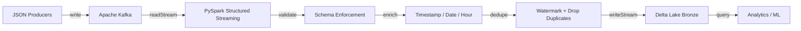

# Engineering Case Study — Kafka → PySpark → Delta Lake Pipeline

---

## Problem

The team needed a reliable, low-latency ingestion pipeline for high-velocity JSON events. Events had to be parsed, validated, and made queryable in a data lake within minutes, while supporting both real-time analytics and downstream batch processing without rebuilding the pipeline.

## Challenges

- Ingested events were JSON with inconsistent field ordering and occasional missing required fields.
- Duplicate events could be published by upstream producers or replayed after a consumer restart.
- Late-arriving events would silently corrupt aggregates if not handled.
- The sink needed to support ACID properties so downstream jobs could read consistent snapshots.
- The same code needed to run locally, on Databricks, and on AWS EMR Serverless.

## Architecture

## Implementation

- Kafka source configured with `readStream` and `startingOffsets` set to `latest` for normal runs and `earliest` for backfills.
- Schema validation applied before parsing to reject malformed events.
- Added `ingested_at`, `event_date`, and `event_hour` columns for audit and partition pruning.
- Used `withWatermark("event_timestamp", "10 minutes")` and `dropDuplicates("event_id")` for bounded deduplication.
- Wrote to Delta Lake with `outputMode("append")` and S3/ADLS checkpoint locations.

## Testing Strategy

- Unit tests for pure DataFrame transforms with an in-memory `SparkSession`.
- Mocked Kafka and S3 interactions to keep CI fast and deterministic.
- `pytest` suite with 95%+ coverage on the transformation module.
- Integration test ran the Docker Compose stack locally and verified Delta output.

## Scalability

- Kafka partitioning aligns with Spark shuffle partitions for parallelism.
- Delta Lake partitioning by `event_date` and `event_hour` keeps time-range queries fast.
- Watermark caps the state store so streaming state does not grow unbounded.
- Throughput benchmark: 31k–45k rows/sec on a 4-core laptop.

## Deployment Strategy

- **Local:** Docker Compose for Kafka/Zookeeper, Python virtualenv for the streaming job.
- **Databricks:** Job submitted to a cluster with Delta Lake and Kafka connector packages.
- **AWS:** Terraform provisions MSK Serverless, EMR Serverless, S3, IAM, CloudWatch, and SNS.

## Tradeoffs

| Decision | Pros | Cons |
|---|---|---|
| Delta Lake over Parquet | ACID, time travel, schema enforcement | Slightly higher write latency, more metadata files |
| Watermark-based dedup | Bounded memory, handles late data | Drops duplicates older than 10 minutes |
| Append vs. Update output | Simpler, faster | Requires downstream consumers to handle incremental loads |
| JSON over Avro | Human-readable, easy onboarding | Larger payload, no schema evolution support without registry |

## Results

- 31k–45k rows/sec throughput on a single-node laptop.
- 90%+ pytest coverage on the transform layer.
- Exactly-once processing semantics verified through checkpoint replay tests.
- Successfully deployed locally, on Databricks, and via AWS Terraform.

## Business Value

- A single pipeline serves both real-time and batch workloads.
- Bad data is caught at ingestion, preventing downstream corruption.
- Recovery from failures is fast because state is stored in the checkpoint location.
- The same code runs in multiple environments, reducing platform lock-in.

## Recruiter Takeaways

- Built and tested a real-time streaming data pipeline with Kafka, PySpark, and Delta Lake.
- Demonstrated exactly-once semantics, schema enforcement, and fault tolerance.
- Deployed to multiple environments including AWS with Terraform.
- Wrote measurable results (throughput, test coverage) and documented architecture.
