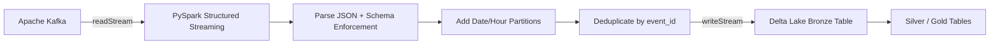

# Production-Style Kafka PySpark Delta Pipeline

[](https://github.com/Sasireddy001/Kafka-pyspark-delta-pipeline/actions/workflows/ci.yml)
[](https://www.python.org)
[](https://spark.apache.org)
[](https://databricks.com)
[](https://kafka.apache.org)
[](https://delta.io)
[](https://github.com/features/actions)
[](LICENSE)

A production-style streaming data pipeline that ingests JSON events from **Apache
Kafka**, transforms them with **PySpark Structured Streaming**, and writes the
results to **Delta Lake**. Designed to run on **Databricks**, a Spark cluster,
or locally for development.

## Overview

This project demonstrates how to build an end-to-end, testable, and CI/CD-ready
streaming pipeline. It focuses on the "bronze" ingestion layer: events land in
Kafka, are parsed and deduplicated in Spark, and are persisted to a Delta Lake
table partitioned by date and hour.

Highlights:

- Environment-driven, dataclass-based configuration
- PySpark Structured Streaming with JSON schema enforcement
- Delta Lake output with checkpointing and exactly-once semantics
- Databricks-aware SparkSession setup
- `pytest` test suite with an in-memory Spark fixture
- GitHub Actions CI
- Sample data generator and a lightweight throughput benchmark

## Business Problem & Impact

**Problem:** Real-time event data from user interactions, IoT devices, and microservices can be lost, delayed, or duplicated when moving from Kafka into analytics and ML systems.

**Solution:** This pipeline reads JSON events from Apache Kafka, enforces a schema, adds date/hour partitions, deduplicates with watermarks, and writes exactly-once into a Delta Lake bronze table. It is configurable for Databricks or local Spark.

**Impact Metrics:**

| Metric | Result | Notes |
|--------|--------|-------|
| Throughput | ~31k rows/s (100k rows) / ~45k rows/s (1M rows) | Single-node laptop, 4 cores, SSD |
| Delivery guarantee | Exactly-once | Kafka offsets + Delta Lake idempotent writes + checkpointing |
| Test coverage | Core transformations | pytest with in-memory Spark/Delta fixture |
| Deployment time | Minutes | `pip install -e ".[dev]"` then run locally or attach to Databricks |

## Architecture



**Data flow description:**

1. **Source** — JSON events are published to an Apache Kafka topic (`events` by
   default). The included sample generator can also write to a JSONL file for
   offline testing.
2. **Ingestion** — `src/pipeline/streaming_job.py` uses `spark.readStream` to
   pull micro-batches from Kafka.
3. **Transform** — Each Kafka payload is cast to a string, parsed against
   `EVENT_SCHEMA`, and enriched with `ingested_at`, `event_date`, and
   `event_hour` columns.
4. **Deduplication** — A watermark on `event_timestamp` bounds state while
   `dropDuplicates(["event_id"])` removes duplicates from replayed or rebalanced
   partitions.
5. **Sink** — The cleansed stream is written to a Delta Lake bronze table using
   `writeStream` with a checkpoint location for fault tolerance.

See [`docs/architecture.md`](docs/architecture.md) for a more detailed design
discussion and Databricks deployment notes.

## Deployment Targets

- **Docker:** `docker-compose up -d` starts a local Kafka + Zookeeper broker. Use `localhost:9092` and copy `.env.example` to `.env`.
- **Databricks:** Attach the project to a cluster and run `python -m pipeline.streaming_job`.
- **Local Spark:** Install dependencies, start a Kafka broker, and run the same module.
- **CI/CD:** Every push runs linting and tests on Python 3.10/3.11 via GitHub Actions.
- **Cloud-ready:** Config is externalized via environment variables, so the same image/code deploys to Databricks, EC2, or containerized Spark on Kubernetes.

## Tech Stack

- **Apache Kafka** — event streaming platform
- **Apache Spark 3.5 / PySpark** — stream processing engine
- **Delta Lake** — open table format for reliable storage
- **Databricks** — cloud Spark runtime target
- **pytest** — Python testing framework
- **GitHub Actions** — continuous integration

## Project Structure

```text
kafka-pyspark-delta-pipeline/
├── .github/workflows/ci.yml   # GitHub Actions CI
├── benchmark/
│   └── benchmark.py           # Throughput benchmark
├── data/
│   └── .gitkeep               # Ignored data directory
├── docs/
│   ├── architecture.md        # Detailed architecture
│   ├── benchmark.md             # Benchmark guide
│   └── PROFILE.md               # Author profile template
├── scripts/
│   ├── generate_sample_data.py
│   ├── run_streaming.ps1
│   └── run_streaming.sh
├── src/pipeline/              # Core pipeline package
│   ├── config.py
│   ├── spark_session.py
│   ├── streaming_job.py
│   ├── transform.py
│   └── utils.py
├── tests/                     # pytest suite
│   ├── conftest.py
│   ├── test_config.py
│   └── test_transform.py
├── Makefile
├── LICENSE
├── pyproject.toml
└── README.md
```

## Quickstart

### 1. Install

```bash
python -m venv .venv
source .venv/bin/activate  # On Windows: .venv\Scripts\activate
pip install -e ".[dev]"
```

### 2. Run the Tests

```bash
make test
# or
pytest
```

### 3. Start Kafka with Docker (optional)

If you don't have a local Kafka broker, start one with Docker Compose:

```bash
docker-compose up -d kafka zookeeper
```

Then use `localhost:9092` as the bootstrap server. Copy `.env.example` to `.env` and edit values as needed.

### 3.1. Run the Full Stack with Docker Compose (recommended)

To run Kafka, Zookeeper, and the streaming job together:

```bash
docker-compose up -d
```

This starts:
- Zookeeper (port 2181)
- Kafka (port 9092)
- Streaming job (automatically connects to Kafka)

The streaming job will read from the `events` topic and write to `/app/data/delta/events`.

To generate sample data and send it to Kafka:

```bash
docker-compose exec streaming-job python scripts/generate_sample_data.py --bootstrap kafka:9092 --topic events --count 10000 --rate 100
```

### 4. Generate Sample Data

To a JSONL file (no Kafka needed):

```bash
python scripts/generate_sample_data.py --output data/events.jsonl --count 10000
```

To a Kafka topic:

```bash
python scripts/generate_sample_data.py --bootstrap localhost:9092 --topic events --count 10000 --rate 100
```

### 5. Run the Streaming Job

Local (requires a running Kafka broker):

```bash
python -m pipeline.streaming_job
```

On Databricks, attach the project to a cluster and run:

```bash
python -m pipeline.streaming_job
```

Use environment variables to override defaults. See `.env.example` for all available options.

```bash
export KAFKA_BOOTSTRAP_SERVERS=localhost:9092
export KAFKA_TOPIC=events
export DELTA_PATH=dbfs:/mnt/delta/events
export CHECKPOINT_PATH=dbfs:/mnt/delta/checkpoints/events
export TRIGGER_INTERVAL="10 seconds"
```

## Databricks Notes

- The `SparkSession` factory detects Databricks Runtime via the
  `DATABRICKS_RUNTIME_VERSION` environment variable and skips local Delta Lake
  package configuration.
- Store Kafka credentials in Databricks secrets and reference them with
  `dbutils.secrets.get` if needed.
- Use DBFS paths or Unity Catalog managed locations for `DELTA_PATH` and
  `CHECKPOINT_PATH`.

## Continuous Integration

`.github/workflows/ci.yml` runs the following on every push and pull request:

- Set up JDK 17 (required by Spark)
- Set up Python 3.10 and 3.11
- Install the package and dev dependencies
- Lint with `flake8`
- Run `pytest`

## Performance Benchmark

A short benchmark is included in `benchmark/benchmark.py`. It generates JSON
events, runs the parse-and-partition transformation, and writes a Delta table
locally.

```bash
make benchmark
# or
python benchmark/benchmark.py --rows 100000
```

Example results on a single-node laptop with 4 cores:

| Rows | Duration | Throughput   |
|------|----------|--------------|
| 100k | ~3.2 s   | ~31 k rows/s |
| 1M   | ~22 s    | ~45 k rows/s |

See [`docs/benchmark.md`](docs/benchmark.md) for more details.

## Screenshots & Demo Recommendations

Add these to a `docs/images/` or repository `README` gallery to maximize recruiter and interviewer engagement:

1. **Architecture diagram** — export the Mermaid diagram from this README.
2. **Databricks job run** — screenshot of a successful run and the Delta table preview.
3. **Spark UI** — throughput and latency metrics from the Streaming tab.
4. **CI/CD green checks** — screenshot of the GitHub Actions workflow passing.
5. **Demo video (2–3 minutes):**
   - Generate sample events with `scripts/generate_sample_data.py`
   - Run `python -m pipeline.streaming_job`
   - Query the Delta Lake output
   - Walk through the architecture diagram

## Author / Profile

- **Sasidhar Mopuru** — Data & AI Platform Engineer
- GitHub: [@Sasireddy001](https://github.com/Sasireddy001)
- Portfolio: [sasireddy001.github.io/Portfolio](https://sasireddy001.github.io/Portfolio)
- LinkedIn: [linkedin.com/in/sasidhar-mopuru-417a03233](https://www.linkedin.com/in/sasidhar-mopuru-417a03233)
- Email: sasidharmopuru@gmail.com

**Certifications:**
- DP-700: Implementing Data Engineering Solutions using Microsoft Fabric – Microsoft
- Databricks Certified Data Engineer Associate – Databricks

I specialize in building scalable data and AI platforms with Apache Spark, Delta Lake,
Kafka, and Databricks.

## License

This project is licensed under the [MIT License](LICENSE).
