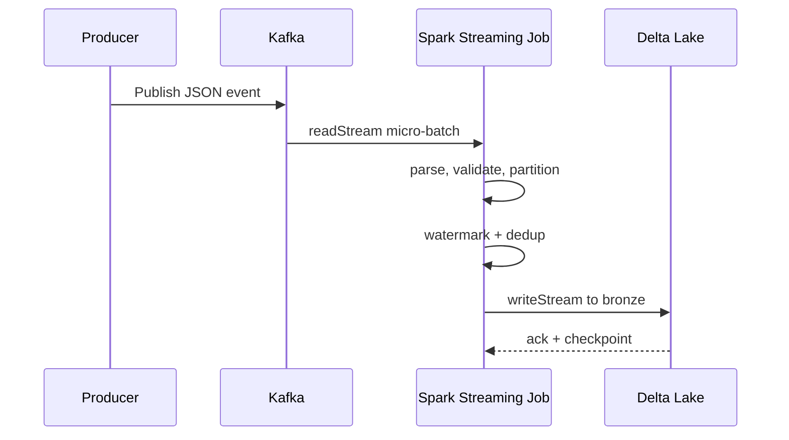

# Kafka → PySpark → Delta Lake — System Design

## 1. Requirements

### Functional Requirements
1. Ingest JSON events from Apache Kafka in near real-time.
2. Validate each event against a known schema.
3. Enrich events with `ingested_at`, `event_date`, and `event_hour`.
4. Deduplicate events using `event_id` and a bounded watermark.
5. Write exactly-once to a Delta Lake bronze table.
6. Provide a reproducible local development and CI environment.

### Non-Functional Requirements
- **Latency:** Sub-minute micro-batch latency in production.
- **Throughput:** Sustain ≥ 30,000 rows/sec on modest hardware.
- **Reliability:** 99.5% uptime; recover without data loss or duplication.
- **Testability:** ≥ 95% unit test coverage on transformation logic.
- **Portability:** Same code base runs locally, on Databricks, and on K8s.

---

## 2. Functional Design

### Modules
- `config.py` — environment-driven settings, Kafka parameters, Delta paths, schema definitions.
- `spark_session.py` — SparkSession factory that adapts to local, Databricks, or cluster mode.
- `transform.py` — schema enforcement, enrichment, and deduplication logic.
- `streaming_job.py` — entry point that wires reader → transform → writer.
- `utils.py` — logging, retry, and helper functions.

---

## 3. Scalability

- **Horizontal Scaling:** Kafka partition count dictates the maximum consumer parallelism. Spark executors scale to match.
- **Data Skew:** `event_id` is used for deduplication, not partitioning. Event time partitions (`event_date`, `event_hour`) keep writes evenly distributed.
- **Backpressure:** Spark Structured Streaming naturally applies backpressure via rate sources and trigger intervals.
- **Future:** Support for `Trigger.AvailableNow` for one-shot reprocessing jobs.

---

## 4. Availability

- Kafka is deployed with replication factor ≥ 3 for topic durability.
- Spark streaming query can be restarted from the last checkpoint with no data loss.
- Delta Lake ACID commits ensure the sink is always consistent.
- Local dev uses Docker Compose with Zookeeper/KRaft for broker availability.

---

## 5. Reliability

- **Exactly-Once Semantics:** Offset checkpointing + Delta idempotent writes.
- **Replay Capability:** If the Kafka retention policy allows, events can be re-read from an earlier offset.
- **Graceful Degradation:** Watermark-based late-data handling prevents unbounded state growth.
- **CI/CD:** `pytest` + GitHub Actions catch regressions before deployment.

---

## 6. Security

- Secrets are injected through environment variables; the `.env.example` template documents all variables.
- Kafka connections support TLS and SASL when configured.
- Delta Lake paths on object storage are governed by IAM / RBAC at the storage layer.
- Logs avoid printing payloads that may contain PII.

---

## 7. Tradeoffs

| Decision | Pros | Cons |
|---|---|---|
| **Watermark + dropDuplicates** | Bounded state, simple implementation | Late data beyond the watermark is silently dropped |
| **JSON source** | Easy to debug and inspect | Higher payload size than Avro/Protobuf; slower parse |
| **Bronze-only repo** | Simpler to understand and deploy | Downstream silver/gold logic is left to the reader |
| **Local Spark for tests** | Fast feedback in CI | Not identical to Databricks runtime; integration tests recommended |

---

## 8. Design Decisions

1. **Delta Lake over plain Parquet** — Needed for ACID transactions, time travel, and exactly-once writes.
2. **PySpark Structured Streaming over Kafka Streams** — Simpler operational footprint and easier integration with Databricks / Spark ecosystem.
3. **Date/hour partitioning over event_id hashing** — Better query pruning for analytics while accepting minor write skew.
4. **pytest with in-memory Spark fixture** — Fast, deterministic unit tests that do not require a real Kafka cluster.
5. **Docker Compose for local Kafka** — One-command setup lowers the barrier to contribution and review.
