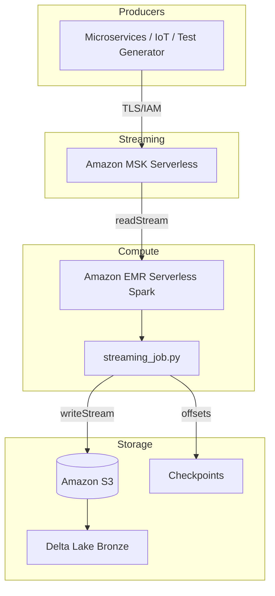

# AWS Cloud Deployment — Kafka → PySpark → Delta Lake

Production-ready Terraform deployment for the Kafka → PySpark → Delta Lake pipeline on AWS. This uses **Amazon MSK Serverless** for Kafka, **Amazon EMR Serverless** for Spark processing, and **Amazon S3** for Delta Lake storage and checkpoints.

## Architecture



## What is provisioned

| Resource | Purpose |
|---|---|
| VPC + public subnets | Network isolation for MSK and EMR |
| Amazon MSK Serverless | Managed Kafka with IAM authentication |
| Amazon S3 bucket | Delta Lake data + Spark checkpoints |
| IAM role | Least-privilege execution role for EMR Serverless |
| Amazon EMR Serverless | Spark application for the streaming job |
| S3 job object | The `src/pipeline/streaming_job.py` uploaded as a deployment artifact |

## Prerequisites

- AWS account
- AWS CLI configured with credentials
- Terraform >= 1.5.0
- GitHub repository secrets set (for CI/CD):
  - `AWS_ACCESS_KEY_ID`
  - `AWS_SECRET_ACCESS_KEY`
  - `AWS_REGION`

## Deployment Steps

1. **Configure variables**

   ```bash
   cd deploy/aws
   cp terraform.tfvars.example terraform.tfvars
   # edit terraform.tfvars as needed
   ```

2. **Initialize and plan**

   ```bash
   terraform init
   terraform plan -out=tfplan
   ```

3. **Apply**

   ```bash
   terraform apply tfplan
   ```

4. **Get outputs**

   ```bash
   terraform output
   ```

   Note `msk_bootstrap_brokers`, `emr_application_id`, `s3_bucket`, and `emr_execution_role_arn`.

5. **Submit the Spark streaming job**

   Use the AWS CLI or the provided `spark-submit.sh` template:

   ```bash
   aws emr-serverless start-job-run \
     --application-id <emr_application_id> \
     --execution-role-arn <emr_execution_role_arn> \
     --job-driver '{
       "sparkSubmit": {
         "entryPoint": "s3://<bucket>/jobs/streaming_job.py",
         "entryPointArguments": [],
         "sparkSubmitParameters": "--conf spark.jars.packages=org.apache.spark:spark-sql-kafka-0-10_2.12:3.5.0,io.delta:delta-core_2.12:2.4.0 --conf spark.sql.extensions=io.delta.sql.DeltaSparkSessionExtension --conf spark.sql.catalog.spark_catalog=org.apache.spark.sql.delta.catalog.DeltaCatalog"
       }
     }'
   ```

6. **Monitor**

   - EMR Serverless job runs: AWS Console → EMR → Serverless → Applications
   - S3 data: `<bucket>/delta/events/`
   - CloudWatch Logs: `/aws/emr-serverless/jobs/<job-id>`

## CI/CD

The `.github/workflows/aws-deploy.yml` workflow is split into two paths:

| Trigger | What it runs |
|---|---|
| `push` / `pull_request` to `deploy/aws/**` or `src/pipeline/**` | `terraform fmt -check` and `terraform validate` only (no AWS credentials needed). |
| `workflow_dispatch` (manual) with `apply: true` | Full `terraform plan` and `terraform apply`, then uploads the streaming job to S3. |

To deploy, first add the following GitHub repository secrets:

- `AWS_ACCESS_KEY_ID`
- `AWS_SECRET_ACCESS_KEY`
- `AWS_REGION` (defaults to `us-east-1` if omitted)

Then run the workflow from **Actions → AWS Deploy → Run workflow** in the GitHub UI.

## Monitoring

CloudWatch dashboards and alarms are provisioned as part of the Terraform stack. See [`MONITORING.md`](MONITORING.md) for the full monitoring guide, alarm thresholds, and runbook.

Also review [`COST_ESTIMATE.md`](COST_ESTIMATE.md) for a dev/prod cost breakdown and [`PRODUCTION_CHECKLIST.md`](PRODUCTION_CHECKLIST.md) for go-live readiness.

## Cost Considerations

- MSK Serverless bills per GB-hour and partition-hour.
- EMR Serverless bills per worker-hour; use auto-stop and scheduled job runs to minimize cost.
- S3 charges for storage and requests; set lifecycle policies to archive old checkpoints.
- Use `terraform destroy` to clean up dev resources when not in use.

## Production Checklist

Before promoting this stack to production, complete the items in [`PRODUCTION_CHECKLIST.md`](PRODUCTION_CHECKLIST.md). It covers infrastructure, Kafka/MSK, EMR Serverless, data quality, monitoring, security, cost, and operations.

## Security

- MSK uses IAM authentication over TLS (`IAM_AUTH` on port 9098).
- S3 bucket has server-side encryption and versioning enabled.
- EMR job execution role follows least privilege (S3 + MSK access only).
- All resources are deployed into a dedicated VPC with security groups.

## Future Improvements

- Add VPC Flow Logs and CloudTrail for audit.
- Replace public subnets with private subnets + NAT Gateway for production.
- Add Amazon CloudWatch alarms for lag and job failure.
- Use AWS Secrets Manager for MSK credentials if SASL/SCRAM is required.
