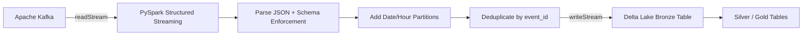

# Architecture

The pipeline ingests real-time JSON events from Apache Kafka, validates and
enriches them with PySpark Structured Streaming, and writes the results to a
Delta Lake bronze table. The design can be deployed on Databricks, an on-premise
Spark cluster, or a local development machine.

## Components

- **Kafka Topic (`events`)**: JSON payloads representing user events.
- **Sample Data Generator** (`scripts/generate_sample_data.py`): Publishes
  synthetic events to Kafka or writes them to a JSONL file for local testing.
- **Streaming Job** (`src/pipeline/streaming_job.py`):
  - Reads from Kafka with `readStream`.
  - Parses JSON payloads against `EVENT_SCHEMA`.
  - Adds `event_date` and `event_hour` partition columns.
  - Deduplicates by `event_id` using a watermark on `event_timestamp`.
  - Writes to Delta Lake with `writeStream` and exactly-once checkpointing.
- **Delta Lake Bronze Table**: ACID transactions, time travel, schema
  enforcement, and incremental downstream consumption.
- **Tests** (`tests/`): `pytest` suite validates parsing, partitioning,
  deduplication, aggregation, and configuration.
- **CI/CD** (`.github/workflows/ci.yml`): GitHub Actions runs lint and tests on
  Python 3.10 and 3.11.

## Data Flow

## Deployment on Databricks

1. Create or use a Databricks cluster running Spark 3.5 with Delta Lake enabled.
2. Install the project: either `pip install -e .` on the driver or attach the
   repo as a notebook-scoped library.
3. Set environment variables for Kafka and Delta paths. Use Databricks secrets
   for any credentials.
4. Run `python -m pipeline.streaming_job` as a long-running streaming job.

## Design Decisions

- **Environment-driven configuration**: `PipelineConfig.from_env()` keeps secrets
  and runtime settings out of source control.
- **Databricks detection**: The SparkSession factory avoids Delta package
  reconfiguration when running on Databricks Runtime.
- **Watermark + deduplication**: Tolerates late-arriving events while keeping
  state bounded.
- **Partitioning**: `event_date` and `event_hour` columns enable efficient
  Delta table pruning and incremental loads.
